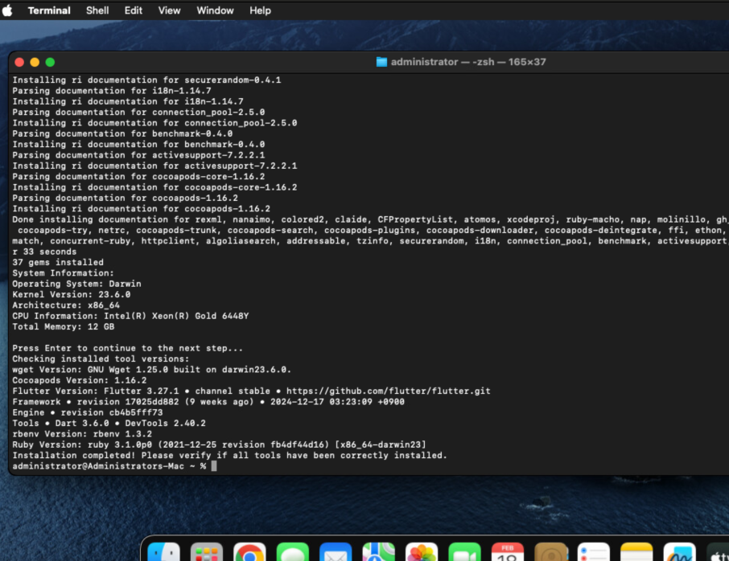
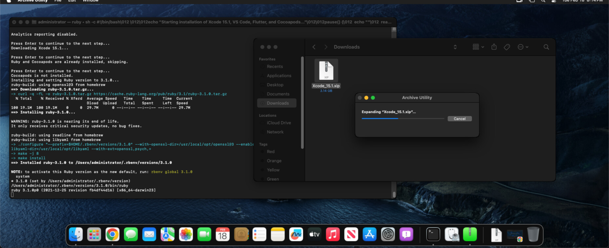

# macOS VPS Development Environment Setup for iOS App Submission

This repository provides a one-click installation script to configure a macOS VPS with essential tools for iOS app development and submission. The script installs and configures **Xcode**, **Visual Studio Code (VSCode)**, **Flutter**, **Ruby**, and **CocoaPods**, streamlining the setup process for building and submitting iOS applications.
( 一键安装集成配置 Macos VPS 系统，安装 XCode，VSCode，Flutter，Ruby，Pod 各种环境 的脚本)
 
## Overview

The script automates the installation and configuration of the following tools on a macOS VPS:
- **Xcode**: Apple's IDE for iOS app development.
- **VSCode**: A lightweight, customizable code editor for Flutter and other development tasks.
- **Flutter**: An open-source framework for building cross-platform apps, including iOS.
- **Ruby**: A programming language required for CocoaPods.
- **CocoaPods**: A dependency manager for iOS projects.

This setup is ideal for developers who need a consistent, automated environment for iOS app development on a macOS VPS.

## Prerequisites

Before running the script, ensure your macOS VPS meets the following requirements:
- **Operating System**: macOS (compatible with versions like Monterey, Ventura, or later).
- **Root/Administrator Access**: Required to install software and modify system settings.
- **Internet Connection**: Necessary for downloading tools and dependencies.
- **Disk Space**: At least 50GB free for Xcode and other tools.
- **Homebrew**: The script will install Homebrew if it's not already present.
- **Apple ID**: Required for downloading Xcode from the Mac App Store (manual step, as prompted by the script).

## Installation

### Step : Run the Script
Execute the setup script as an administrator:

```bash
# install all app
sh -c "$(curl -fsSL https://raw.githubusercontent.com/nicolastinkl/macos2setup/refs/heads/main/install_tools.sh)"

# install xcode only
sh -c "$(curl -fsSL https://raw.githubusercontent.com/nicolastinkl/macos2setup/refs/heads/main/install_xcode.sh)"

```

The script will:
1. Install Homebrew (if not already installed).
2. Install Xcode (prompting for Apple ID login if necessary).
3. Install VSCode.
4. Install Flutter and configure its environment.
5. Install Ruby using `rbenv` for version management.
6. Install CocoaPods.
7. Verify installations and configure environment variables.

**Note**: During Xcode installation, you may need to manually sign in with your Apple ID in the Mac App Store, as prompted by the script.

### Step 4: Follow Prompts
The script includes interactive prompts to handle specific configurations, such as:
- Accepting Xcode's license agreement.
- Setting up Flutter's iOS toolchain.
- Configuring Ruby versions for CocoaPods.

## Usage

Once the script completes, your macOS VPS will be ready for iOS app development. Here’s how to get started:



### Xcode
- Launch Xcode: `open /Applications/Xcode.app`
- Use Xcode to create, build, and submit iOS apps to the App Store.
- Ensure you configure your Apple Developer account in Xcode for signing and submission.

### VSCode
- Open VSCode: `code`
- Install recommended extensions for Flutter (e.g., Flutter and Dart extensions) via the VSCode marketplace.
- Use VSCode for Flutter development or editing project files.

### Flutter
- Verify Flutter setup: `flutter doctor`
- Create a new Flutter project: `flutter create my_app`
- Build iOS apps: `flutter build ios`

### Ruby and CocoaPods
- Check Ruby version: `ruby -v`
- Initialize a CocoaPods project: `pod init` in your iOS project directory.
- Install dependencies: `pod install`

## Troubleshooting

- **Xcode Installation Fails**: Ensure your Apple ID is valid and the Mac App Store is accessible. Check your internet connection.
- **Flutter Doctor Issues**: Run `flutter doctor` and follow its recommendations to resolve missing dependencies.
- **CocoaPods Errors**: Ensure the correct Ruby version is active (`rbenv global 3.2.2`) and reinstall CocoaPods if needed (`gem install cocoapods`).
- **Disk Space**: Verify sufficient disk space before running the script.

## Contributing

Contributions are welcome! If you encounter issues or have suggestions, please:
1. Open an issue on the GitHub repository.
2. Submit a pull request with your changes.

## License

This project is licensed under the MIT License. See the [LICENSE](LICENSE) file for details.
